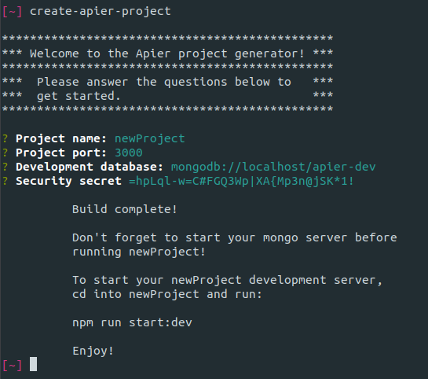

# Create a new Apier project

> Greetings fellow devs! Welcome to the first of the Apier tutorial series! In
> this tutorial we'll be going over the reasoning behind Apier and the basic
> steps to creating a new project. So sit back, fire up your learning hat, and
> follow me to API bliss!

## **Step 1.** _Install the CLI tool_

> In your terminal run

```
npm install --global create-apier-cli
```

> This will install the cli package globally via npm

## **Step 2.** _Create a new project_

> Navigate to the directory where you'd like to store your project, then from
> that directory in the terminal run

```
create-apier-project
```

> You will be prompted with a few self explanatory setup options - defaults are
> provided and easily changed



> After the options are set, the latest base Apier project template will be
> cloned from github and installed

> Given the options chosen in the screenshot above, the project's name is
> 'newProject', it will run on port 3000, it will use
> 'mongodb://localhost/apier-dev' to connect to the database via mongoose, and
> it will have a random string of characters for a security secret

## **Step 3.** _Run the project_

> First, make sure your Mongo DB development server is running _(on localhost in
> this case)_

> Navigate to the newly created project directory _(newProject in this case)_
> and run

```
npm run start:dev
```

> This will start the development environment with the server running via
> nodemon - any changes that occur in the project directory will cause a restart
> to the server.

---

# That's all there is to it! You're now running a fully scaffolded Express api server with a persistent storage connection to Mongo DB.

### Stay tuned for the next tutorial, [**Basic Authentication with Apier**](/docs/1-Basic_Authentication_with_Apier.md), where we'll go over the User schema and Auth routes provided out of the box.
